# ▤ Run the engagement retrospective

A **blameless retrospective**, narrowed to one subject: the gap between what
the method says and what the work needed. Every method improvement starts as
somebody improvising, so ask while the improvising is still fresh.

## ⊕ When to use this

| The situation | What it looks like |
| ------------- | ------------------ |
| Work finished | An initiative merged, or a client engagement was delivered |
| Judgement was exercised | Someone ran the method end to end and had to decide things it was silent on |

Run it after the work, never during.

## ⊖ When not to

| The situation | Use instead |
| ------------- | ----------- |
| After every commit | Nothing — the subject is an engagement, not a change |
| A general project retrospective | Whatever the team already uses; this one is narrower on purpose |
| To change a skill directly | `align-change-through-layers` — this proposes, it never edits |

## ⌖ Where this sits

Realizes `BPROC4.1`, the whole of the Evaluation band. It carries no gate: it
**proposes**, and each proposal becomes its own change through the gates.

```mermaid
flowchart LR
  fin(["An initiative or engagement just finished"])
  q["⚙ Ask the six questions"]
  note[/"docs/engagements/N_*.md"/]
  prop(["Proposals — one row each"])
  init(["Raised as its own initiative"])
  g2{{"❖ Understanding — on that initiative, not here"}}

  fin --> q --> note --> prop --> init --> g2

  classDef business fill:#fffbb5,stroke:#c8c04a,color:#333
  classDef implementation fill:#ffd6d6,stroke:#d99b9b,color:#333
  classDef artifact fill:#eef2f7,stroke:#9fb0c4,color:#333
  class fin,q,prop,init business
  class g2 implementation
  class note artifact
```



## ▤ Template

One file per retrospective, numbered chronologically, in the organization's
own `docs/engagements/` — or wherever that project's `AGENTS.md` names.

```markdown
# N — <what the work was, in the most general terms that stay true>

**Date:** YYYY-MM-DD
**Kind:** initiative | client engagement
**Delivered:** <link to the scope document, or "not public">

## What the method did not cover

<The improvised moments. One heading each where there were several.>

## What was done instead, and why

<The reasoning. Not the steps.>

## Does it generalize?

<Per moment: yes / specific to this / not yet known. Say which and why.>

## What surprised us

<The wrongness signals — where the stated frame turned out to be wrong.>

## Deliberately not recorded

<That client-confidential material was excluded, and roughly what kind.
Never the material itself.>

## Proposed

| # | Skill or document | The sentence it would add | Raised as |
| - | ----------------- | ------------------------- | --------- |
| 1 | `<skill>`         | <one sentence>            | <initiative, or "not yet"> |

<Or: "Nothing generalizable this time." — a complete and acceptable answer.>
```

## ※ Rules

### The six questions

Ask them in order, in one pass, of whoever did the work. Minutes of real
thinking, not an hour of recollection.

| # | Question | What it is for |
| - | -------- | -------------- |
| 1 | Where did the method not tell you what to do? | The improvised moments — where the skills were silent |
| 2 | What did you do instead, and why that? | The reasoning transfers; the action rarely does |
| 3 | Would you do the same next time, or was it specific to this? | The generalization test. Most answers are "specific to this", and that is a good answer |
| 4 | What did the Requester or client say that surprised you? | The wrongness signal — a segment named wrong, a symptom presented as a cause, a constraint that was not one |
| 5 | What did you decide not to write down, and why? | Makes the confidentiality boundary explicit instead of assumed |
| 6 | If this became a skill edit, which skill, and what sentence? | Forces an actionable output. A pattern that cannot be written as a sentence is not ready |

### No client facts

Names, figures, industries specific enough to identify, anything told in
confidence — none of it goes in the note. The note records the **pattern**,
not the case.

> "An owner presented a symptom as the problem, and the frame only broke when
> the fifth question contradicted the first" is a pattern. The same sentence
> with the company in it is a leak.

Two tests before writing a sentence:

- **Would the client recognise themselves in it?** Generalize until they would
  not, or drop it.
- **Does it still teach something once the specifics are gone?** If not, it
  was a fact about that client rather than a pattern.

### A note that proposes nothing is still a note

Not every engagement teaches something. Recording "nothing generalizable this
time" is evidence in its own right. **Never invent a finding to make a note
look worthwhile.**

### Proposals become initiatives, not edits

This skill never edits a skill, a layer document or a rule. Each proposal is
picked up as its own change, with the gates that implies.

### Two notes make a pattern

When something appears in **two** notes it has stopped being a coincidence and
should be raised that week. When it appears in one, wait — the generalization
test is unreliable on a single case.

## ⇄ Hands off to

| Skill | When | What comes back |
| ----- | ---- | --------------- |
| `align-change-through-layers` | A proposal is raised as an initiative | The method change, through the gates like any other |
| `write-scope-document` | That initiative needs its scope recorded | A scope document the proposal row can point at |

## ⚠ Anti-patterns

- Writing a diary. "Discovery went well" teaches nobody anything.
- Inventing a finding so the note looks worthwhile.
- Letting an identifying detail travel with the pattern.
- Editing a skill directly from the note.
- Acting on a pattern that has appeared exactly once.

## ☑ Done when

- All six questions were asked, in order, of whoever did the work.
- Every improvised moment has a generalization verdict.
- The Deliberately not recorded section says what kind of material was
  excluded, and none of the material itself.
- Proposed carries one row per proposal, or the sentence that says there are none.
- Nothing in the note would let a reader identify the client.
