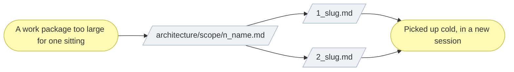

# ▤ Shard stories

Vertical slicing, with the context packed in. The practice is adapted from
[BMAD-METHOD](https://github.com/bmadcode/BMAD-METHOD)'s context-engineered
development, and the failure mode it targets is an agent — or a person
returning after a break — re-reading the whole model just to work out what one
slice of work requires.

A story fixes that by being **self-contained**: actionable from its own text
plus the links it cites, and nothing else.

## ⊕ When to use this

| The situation | What it looks like |
| ------------- | ------------------ |
| Independent deliverables | A work package holds pieces that could be built, reviewed or merged separately |
| Spans a boundary | The work runs past one session or one pull request |
| More than one pair of hands | Different people or agents pick up different pieces |

## ⊖ When not to

| The situation | Use instead |
| ------------- | ----------- |
| The work package finishes in one sitting | An inline task list in the scope document — the default |
| The scope itself is wrong | Fix the scope document; a story never renegotiates scope |

Small initiatives do not need this file at all.

## ⌖ Where this sits

Realizes `BPROC2.2`, inside implementation. It carries no gate: the gates were
granted against the scope document before any of this work began, and a story
inherits them rather than adding one.



## ▤ Template

Stories live alongside the initiative's scope document, in
`architecture/scope/<n>_<name>-stories/`, one file per story, numbered in build
order. The work package keeps its **Deliverables** and **Outcome** summary and
links to the stories instead of expanding into a task list inline.

```markdown
# Story <n>.<m> — <Name>

_[← Scope document](../<n>_<name>.md)_

**Goal:** <one sentence — what this story delivers.>

## Context

<Only links, not restated content — the specific document sections and
glossary terms this story needs, e.g.:>

- [Business rule RULE7](../../2_business/5_domain-context-and-rules.md#...)
- [Component X](../../4_application/2_application-components.md#...)

## Acceptance criteria

- [ ] <Concrete, checkable outcome>
- [ ] <Concrete, checkable outcome>

## Definition of done

- <Verification commands specific to this story>
- <Document updates this story is expected to make, if any>

## Out of scope

- <Explicitly deferred to a later story — link it if it already exists>
```

## ※ Rules

- **A story is actionable from its own text plus its links alone.** If
  implementing it means opening documents the story does not cite, the story
  is missing context. Add the link; do not assume prior chat history carries
  it.
- **Links, not restated rationale.** A story points at the document that owns
  a rule or a component; it never re-explains the rule. Rationale keeps one
  home.
- **Treat every story as a cold handoff.** Picking one up, read only the story
  and what it links to before starting. Needing the conversation that produced
  the scope document is the defect this skill exists to prevent.
- **The scope document stays the source of truth for scope.** Stories inherit
  its alignment table and its in-and-out-of-scope decisions. Where a story
  reveals the scope document was wrong, fix the scope document in the same
  change — not only the story.
- **Number in build order.** The sequence is the plan; a story that cannot be
  placed in it is probably two stories.

## ✎ Worked example

> A work package delivers an importer, a schema migration and a settings
> screen. Three deliverables, reviewable separately, spanning several
> sessions — so three stories in build order, the migration first because the
> other two cite it. Each names the business rule it implements by link, and
> the work package in the scope document shrinks to an outcome sentence and
> three links.

## ⚠ Anti-patterns

- Sharding a work package that would have finished in one sitting.
- A story that restates a rule instead of linking the document that owns it.
- A story whose acceptance criteria are not checkable.
- Renegotiating scope inside a story rather than correcting the scope document.
- Leaving the work package's full task list in place beside the stories, so
  the same plan exists twice.

## ☑ Done when

- Every story has a goal, checkable acceptance criteria, and a definition of done.
- Every story links the sections it needs, and cites nothing it does not.
- The stories are numbered in build order.
- The scope document's work package links them instead of listing their tasks.
- A reader given one story and no history could start it.
