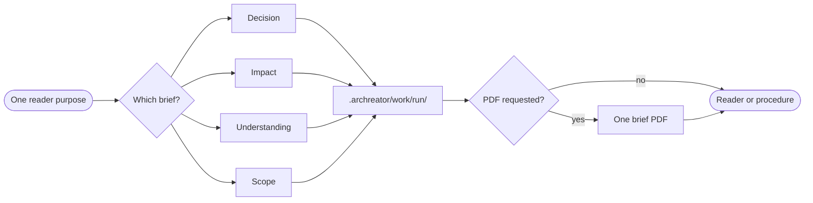

# ▤ Write a focused brief

A brief is a disposable reading of current sources for one purpose. It carries
only the context needed to understand, decide or coordinate the named matter;
it never becomes a second architecture model.

## ⊕ When to use this

| Situation | Brief |
| --- | --- |
| A person must resolve one open question or authorize one material action | Decision |
| A proposed change must be traced across relevant context | Impact |
| A reader needs to learn what exists and how it fits together | Understanding |
| A delivery needs a bounded outcome, responsibilities and verification plan | Scope |
| A business reader requests a directly commentable artifact | The relevant brief, optionally exported to PDF |

## ⊖ When not to

| Situation | Better route |
| --- | --- |
| A short grounded answer is enough | Answer directly with `answer-context-question` |
| A choice has been made and its rationale must outlive the initiative | `record-decision` |
| The whole architecture needs a browsing interface | Generate the on-demand portal |
| The model itself is missing or wrong | `model-context` or `deliver-change` |
| Someone asks for the whole model as a PDF | Use repository or portal navigation; do not create it |

## ⌖ Where this sits

Supports Answer a context question [BPROC2.1], Plan a roadmap [BPROC2.2] and
Frame and assess a change [BPROC3.1]. It owns no gate: a procedure
may use a decision brief at its conditional checkpoint, but the document does
not authorize anything by existing.



## ▤ Template

Create the run with the ArChreator `work` command or another safe project-local
operation. Name the file `<kind>-<short-subject>.md` inside
`.archreator/work/<run>/`.

Every brief begins:

```markdown
# <Brief title>

| Field | Value |
| --- | --- |
| Purpose | <The one question this brief serves> |
| Reader | <Role or audience> |
| Boundary | <Included context and material exclusions> |
| Sources | <Links to canonical files and accessible external models> |
| Source revision | <Revision, date or explicit live-working-tree state> |

<The direct answer, recommendation or scope in one short paragraph.>
```

Add only the matching variant below.

### Decision brief

```markdown
## Decision needed

<One answerable question, the accountable decision owner and when the answer
is needed.>

## Necessary context

<Only facts and constraints that can change the answer. Mark gaps,
inconsistencies and unavailable evidence explicitly.>

## Options and consequences

| Option | Benefits | Costs or risks | Affected context |
| --- | --- | --- | --- |

## Recommendation

<Recommended option and the decisive reason.>

## Response

<The exact choice, authorization or missing fact requested.>
```

### Impact brief

```markdown
## Proposed change

<Outcome and meaningful unchanged boundary.>

## Impact view

<One focused Mermaid view when the relationship chain is easier to understand
visually.>

| Element or model | Relationship to the change | Effect | Owner | Source |
| --- | --- | --- | --- | --- |

## Risks and unknowns

<Material risks, gaps, inconsistent evidence and inaccessible related models.>
```

Trace declared relationships in both directions. Distinguish direct impact,
indirect impact and an unchanged boundary rather than listing every nearby
element.

### Understanding brief

```markdown
## What this is

<Purpose, value and boundary in the reader's language.>

## Current view

<One useful visual when relationships, flow or sequence benefit from it.>

## Important parts and relationships

<A short narrative or table focused on the reader's question.>

## Constraints and considerations

<Only context that materially affects understanding or use.>

## Where to go deeper

<Direct source links in a useful reading order.>
```

### Scope brief

```markdown
## Outcome and acceptance

<Observable outcome and evidence that will show it is complete.>

## In scope and out of scope

| In scope | Out of scope and consequence |
| --- | --- |

## Affected context

<Changed facts, unchanged contracts, owners and repositories.>

## Delivery and verification

<The smallest useful work packages, dependencies and checks.>

## Open decisions

<Only gaps, inconsistencies or authorization still needed; remove this section
when none exist.>
```

## ※ Rules

- Build the brief from canonical Markdown and implementation evidence. A prior
  brief, portal or PDF is never authoritative.
- State facts, inferences, assumptions and unavailable context distinctly.
- Reference every modeled element as `Name [ID]`; retain ArchiMate semantics
  and source links where they make the view precise. A brief does not redefine
  canonical catalogue rows.
- Keep one purpose and one primary reader. Split competing purposes rather than
  producing a general architecture report.
- Remove every unused heading and instruction. The templates are maximum
  shapes, not required empty sections.
- A decision brief contains the minimum context needed to answer the decision.
  An understanding brief may teach more widely; an impact brief follows the
  relationship chain; a scope brief coordinates delivery.
- Keep the source revision and boundary visible. Regenerate after relevant
  source changes.
- Export only the individual brief or scope to PDF, and only when requested.
  Write the PDF beside its Markdown source under the same work run.
- Never copy a brief, its PDF or the portal into `architecture/`.

## ⇄ Hands off to

| Skill | What it receives | What comes back |
| --- | --- | --- |
| `answer-context-question` | A requested reading purpose and model anchor | A grounded question, selected brief kind and final explanation |
| `deliver-change` | A scope, impact or decision brief | Delivery or a focused conditional checkpoint |
| `plan-roadmap` | A planning boundary and current/target comparison | Accepted direction for canonical transition context |
| `record-decision` | An accepted material choice that needs durable rationale | A canonical, linked decision record |

## ⚠ Anti-patterns

- A decision brief that teaches the whole architecture before asking one
  question.
- A scope treated as mandatory evidence that work may start.
- An impact list produced from keyword proximity instead of relationships and
  implementation evidence.
- Facts copied into a brief without source links or a revision boundary.
- Empty template sections retained to look complete.
- A whole-model PDF described as a focused brief.

## ☑ Done when

- The brief has one declared purpose, reader, boundary and source revision.
- Its variant contains enough—and only enough—context for that purpose.
- Every material claim resolves to canonical or implementation evidence.
- Gaps, inconsistencies and unavailable context are visible rather than filled
  by assumption.
- The file and any requested PDF remain under `.archreator/work/<run>/`.
