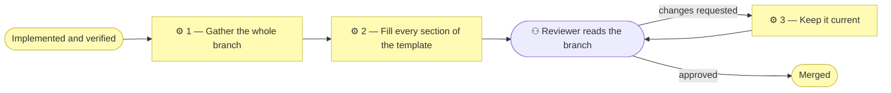

# ⚙ Write a PR description

The handover. A pull request is reviewed and merged as a unit, so its body
describes the whole branch — not the commit that happened to be last.

## ⊕ When to use this

| The situation | What it looks like |
| ------------- | ------------------ |
| Opening a PR | The work is implemented and verified, and the branch is ready for a Reviewer |
| Pushing more commits | A PR is already open and the branch has moved since the body was written |

## ⊖ When not to

| The situation | Use instead |
| ------------- | ----------- |
| The work is not verified yet | `align-change-through-layers` Step 7 — verify, then hand over |
| The scope document's Approvals table is empty | The gates have not been granted; the branch is not ready for review |

## ⌖ Where this sits

Realizes `BPROC2.3`, the last process before merge. It carries **no gate** —
the gates are granted before code exists. What waits here is the Reviewer,
whose approval is ordinary review rather than a recorded gate.



## ⚓ Invariants

- **The body describes the branch, not the commit.** A reader approving a PR
  is approving everything in `main...HEAD`.
- **The description is a living document until merge.** A body that was true
  at the first push and stale at the fifth is worse than no body, because it
  reads as current.

## ⚙ Steps

### 1 — Gather the whole branch

```bash
git log --oneline main..HEAD
git diff main...HEAD --stat
```

**⚖ Judgement.** If the branch carries more than one initiative, say so and
link each scope document; the Changes section then gets one subsection per
initiative.

**→ Produces** the commit list and the file list the body must account for.

### 2 — Fill every section of the template

There is one template, `.github/pull_request_template.md`, and every kind of
change fills the same body — a pure bug fix included.

| Section | Holds |
| ------- | ----- |
| **Summary** | What the branch delivers, in two to four sentences |
| **Scope document** | The `architecture/scope/N_*.md` file(s) this branch adds or updates. Its Approvals table must already record the gates the change required — Understanding at minimum, per `align-change-through-layers` § The gates. A pure bug fix states "no scope document" with what broke, the root cause and the fix |
| **EA layers touched** | The verdicts copied from the scope document's alignment table. Every layer gets one, including an explicit "no change" |
| **Changes** | Grouped by work package or area, covering the full `main...HEAD` diff |
| **Complexity** | What was removed, and what new recurring cost the change adds — a file in the scaffold, a check to keep green, a copy to hold together — with why it is justified. "Nothing removed, nothing recurring added" is a complete answer |
| **Verification** | The commands run — lint, typecheck, tests, build — and their results, plus manual and end-to-end checks |
| **Out of scope / follow-ups** | The scope document's gap notes, mirrored |

**⚖ Judgement.** If a file change is not explainable under Changes, it either
needs a mention or does not belong on the branch. An unexplainable diff is the
signal, not the inconvenience.

**← Needs** the commit list, the file list, the scope document.

**→ Produces** the pull-request body.

### 3 — Keep it current

When the branch gains commits, re-run the two commands from Step 1 and
reconcile the body against them.

**← Needs** the branch, as it now stands.

**→ Produces** an updated pull-request body.

## ⇄ Hands off to

| Skill | When | What comes back |
| ----- | ---- | --------------- |
| `write-scope-document` | The scope document's Approvals table or gap notes need correcting before review | A scope document the body can cite honestly |

## ✎ Worked example

> A branch carries six commits: four bug fixes and two that add a process
> model. `git log main..HEAD` shows both initiatives, so Changes gets two
> subsections, Scope document links the one initiative that needed a document
> and states "no scope document" with a root cause for the fixes, and EA
> layers touched carries an explicit "no change" for the four layers neither
> initiative moved.

## ⚠ Anti-patterns

- Describing the latest commit rather than the branch.
- Leaving the body as written at the first push after the branch has moved.
- Opening a PR whose scope document has an empty Approvals table.
- Omitting a layer from EA layers touched instead of writing "no change".

## ☑ Done when

- Every section of the template is filled.
- Every commit in `main..HEAD` is represented under Changes.
- Every EA layer has a verdict.
- The scope document is linked, or its absence is explained.
- Verification names the commands run and what they returned.
