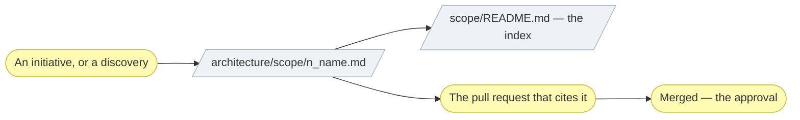

# ▤ Write a scope document

One document per initiative. An **architecture definition** narrowed to a
single change: what it alters, which layers it touches, what it deliberately
left out, and the pull request whose merge approved it.

## ⊕ When to use this

| The situation | What it looks like |
| ------------- | ------------------ |
| An initiative starts | Step 3 of `align-change-through-layers`, before implementing |
| Discovery starts | `discover-business-model` or `discover-strategy` needs somewhere to record what it delivered |
| An initiative moves | The work diverged from the plan, and the document has to stay true to what shipped |

## ⊖ When not to

| The situation | Use instead |
| ------------- | ----------- |
| One consequential call, no elements changed | `record-decision` |
| A pure bug fix with no documented behavior change | Nothing — say "no scope document" in the pull request, with the root cause |
| The document is merged and a claim in it is now wrong | A new numbered document. A merged record is history |

## ⌖ Where this sits

Realizes `BPROC2.1`. It carries no approval of its own: it is the artifact
the pull request cites, and so it is created **before** implementing, then
refined as the work proceeds.



## ▤ Template

Named `<n>_<kebab-case-name>.md`, where `<n>` is the next number in the
chronological sequence — check the index in `architecture/scope/README.md`
(the first initiative creates the folder from the plugin's
`assets/layers/scope/`, which carries the index), and add the new document to
it in the same change.

```markdown
# Project Scope — <Initiative Name>

_[← Scope index](./README.md) · [Model home](../README.md)_

**ArchiMate viewpoint:** Implementation & Migration.
**Delivered as:** <branch and/or PR reference>.

<One paragraph: what this initiative changes and why now.>

## EA alignment (assessed top-down before implementing)

| Layer         | Impact                                              |
| ------------- | ---------------------------------------------------- |
| 0_business-design | <canvases added/changed — or "not used" for an application project> |
| 1_strategy    | <new/changed goals, drivers — or "no change" + why> |
| 2_business    | <services, processes, rules, glossary>              |
| 3_information | <data objects, flows, storage, classification>      |
| 4_application | <services, components, ports>                       |
| 5_technology  | <runtimes, build, CI, hosting>                      |

## Plateaus

| Plateau                | State                     |
| ----------------------- | ------------------------- |
| **Baseline** (before)  | <state before the change> |
| **Target** (delivered) | <state after the change>  |

## Work packages and deliverables

### WP1 — <name>

- **Deliverables:** <files, modules, docs — concrete artifacts>
- **Outcome:** <the capability gained>

## In scope / out of scope

| In scope | Out of scope (gaps, candidate future work) |
| -------- | ------------------------------------------- |
| …        | …                                           |

## Gap notes

- <Each out-of-scope item that leaves a real gap: what closing it would
  take, and what makes it easy or hard.>
```

## ※ Rules

- **Every layer gets a verdict**, including an explicit "no change". Silence
  is not a decision.
- **The pull request's merge is the approval, and nothing records one before
  it.** No Approvals table, no row to write — `align-change-through-layers`
  § Where this stops.
- **A merged pull request promotes the documents it changed**
  (`architecture-document-style` § Document status). The merge is what says
  the model claims are stood behind, not a separate ceremony.
- **An interpretation the agent adopted is recorded where it applies**, never
  in a register of pending questions: the affected row's `Source` cell reads
  `adopted — <the call>`, and the document stays `◐` —
  `align-change-through-layers` § Ask only what blocks the work now.
- **Deliverables are concrete artifacts** — file paths, page or screen names —
  never "improved UX".
- **The consolidation record lives here, not in the layer documents.** How
  many elements each catalogue ended up with, what was merged into what, and
  why, is a modeling decision the document itself records (`document-style`
  § What the document contains).
- **Out of scope is as important as in scope** — it is where the next
  initiative's backlog lives. Pair each meaningful exclusion with a gap note.
- **Where the project keeps a roadmap, gap notes have somewhere to go.** A gap
  note expires with the document it was written in; a row in
  `architecture/6_transition/` does not. Where the initiative closes gaps the
  roadmap already carries, name them here and mark them there in the same
  change — `plan-the-transition` § 6 — Bind the roadmap to the spine holds
  both halves. A project with no roadmap keeps its gap notes and loses nothing.
- **A merged scope document is a historical record.** Follow-up work gets a
  new numbered document.
- **The record is what it says, not where its links point.** When a later
  change moves a file, update the *link targets* in merged documents so they
  still resolve, and leave every word alone — including link text, which was
  accurate when written.
- A small Mermaid plateau diagram is optional, using the `implementation`
  classDef from the notation conventions.

## ✎ Worked example

> A docs-only discovery initiative records what it delivered — the strategy
> documents it changed, and the "no change" verdicts for the layers it never
> touched. The pull request that carries it links every changed document; its
> merge is what approves them.

## ⚠ Anti-patterns

- Adding an Approvals table, or any row claiming an approval before the merge.
- Leaving a layer out of the alignment table because nothing changed there.
- Parking an adopted interpretation in a list of questions instead of writing
  it into the row it changed.
- Rewriting a merged document instead of writing the next one.
- Putting the consolidation counts in the layer documents.

## ☑ Done when

- The document is numbered, named and added to the index in the same change.
- Every layer has a verdict.
- Anything the Requester provided is filed in `architecture/reference/` and
  indexed there, and the elements derived from it name it.
- Deliverables name artifacts, not intentions.
- Every meaningful exclusion has a gap note.
- Every interpretation the agent adopted reads `adopted — <the call>` in the
  row it changed, in a document still marked `◐`.
