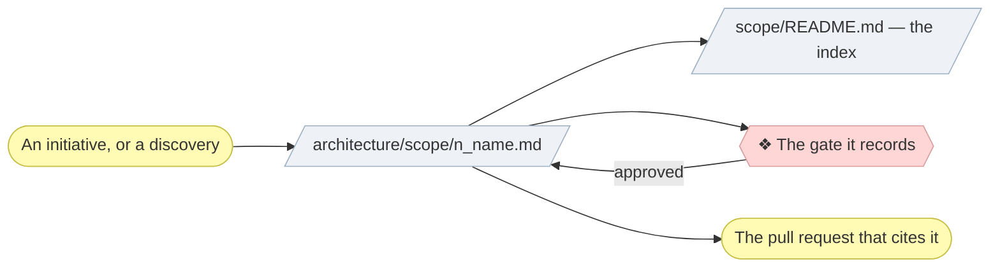

# ▤ Write a scope document

One document per initiative, and the place its gate approvals are recorded.
An **architecture definition** narrowed to a single change: what it alters,
which layers it touches, who approved it, and what it deliberately left out.

## ⊕ When to use this

| The situation | What it looks like |
| ------------- | ------------------ |
| An initiative starts | Step 3 of `align-change-through-layers`, before the gate that approves it |
| Discovery starts | `discover-business-model` or `discover-strategy` needs somewhere to record Direction |
| An initiative moves | The work diverged from the plan, and the document has to stay true to what shipped |

## ⊖ When not to

| The situation | Use instead |
| ------------- | ----------- |
| One consequential call, no elements changed | `record-decision` |
| A pure bug fix with no documented behavior change | Nothing — say "no scope document" in the pull request, with the root cause |
| The document is merged and a claim in it is now wrong | A new numbered document. A merged record is history |

## ⌖ Where this sits

Realizes `BPROC2.1`. It carries no gate of its own — it is the artifact the
gates are recorded *in*, which is why it is created **before** the gate rather
than after.



## ▤ Template

Named `<n>_<kebab-case-name>.md`, where `<n>` is the next number in the
chronological sequence — check the index in `architecture/scope/README.md`
(the first initiative creates the folder from the plugin's
`assets/layers/scope/`, which carries the index and the optional
open-questions log),
and add the new document to it in the same change.

```markdown
# Project Scope — <Initiative Name>

_[← Scope index](./README.md) · [Model home](../README.md)_

**ArchiMate viewpoint:** Implementation & Migration.
**Delivered as:** <branch and/or PR reference>.

<One paragraph: what this initiative changes and why now.>

## EA alignment (assessed top-down before implementing)

| Layer         | Impact                                              |
| ------------- | ---------------------------------------------------- |
| 0_business-design | <canvases added/changed — or "not used" for an application project> |
| 1_strategy    | <new/changed goals, drivers — or "no change" + why> |
| 2_business    | <services, processes, rules, glossary>              |
| 3_information | <data objects, flows, storage, classification>      |
| 4_application | <services, components, ports>                       |
| 5_technology  | <runtimes, build, CI, hosting>                      |

## Approvals

| Gate | Approved by | Date | What was approved |
| ---- | ----------- | ---- | ----------------- |
| Understanding | <Requester> | <YYYY-MM-DD> | <the documents and sections presented> |

<!--
  One row per gate this initiative actually reached, plus one for any gate that
  could have applied and did not — `N/A — <why>`. A gate the project's depth
  never had gets no row at all.

  Direction, where the subject is an organization, is two rows: the canvases,
  then the strategy derived from them. Design gets a row only when it was
  offered — approved, or `N/A — not requested`.

  An unscheduled stop gets a row too, with the reason in place of a gate name:
  `Authorization` or `Material uncertainty`.
-->

## Plateaus

| Plateau                | State                     |
| ----------------------- | ------------------------- |
| **Baseline** (before)  | <state before the change> |
| **Target** (delivered) | <state after the change>  |

## Work packages and deliverables

### WP1 — <name>

- **Deliverables:** <files, modules, docs — concrete artifacts>
- **Outcome:** <the capability gained>

## In scope / out of scope

| In scope | Out of scope (gaps, candidate future work) |
| -------- | ------------------------------------------- |
| …        | …                                           |

## Gap notes

- <Each out-of-scope item that leaves a real gap: what closing it would
  take, and what makes it easy or hard.>

## Open questions

- <Only if there are any: adopted interpretations that the product owner
  or stakeholders still need to confirm, each linked to the document where
  the interpretation was applied.>
```

## ※ Rules

- **Every layer gets a verdict**, including an explicit "no change". Silence
  is not a decision.
- **Every gate gets a row, including the ones that did not apply.** Which gate
  applies is defined in exactly one place — `align-change-through-layers` §
  The gates — and the short form is that Understanding applies to every initiative
  that changes documented behavior, which is every initiative that will
  produce code; a docs-only initiative passes Direction instead. A gate
  that could have applied and did not is written `N/A — <why>` rather than
  deleted, so a reader
  can tell a skipped gate from a forgotten one. **An approval that isn't
  recorded didn't happen.**
- **A granted gate promotes the documents it covered.** Recording the approval
  is half of it; the other half is moving each covered document's status line
  from `◐ Draft catalogue` to `● Validated`, with the gate and the date, and
  emptying its `Notes` column (`architecture-document-style` § Document
  status). The Approvals row and the status lines say the same thing in the
  two places a reader looks, and a row without the lines leaves the model
  claiming nothing was approved.
- **"What was approved" names the documents put in front of the Requester**,
  not the topic in the abstract. The gate presentation links them in full
  (`align-change-through-layers` § Show the Requester what they are approving);
  the row is what says which ones they were.
- **Deliverables are concrete artifacts** — file paths, page or screen names —
  never "improved UX".
- **The consolidation record lives here, not in the layer documents.** How
  many elements each catalogue ended up with, what was merged into what, and
  why, is a modeling decision the Requester approves. A layer document that
  also states it holds a second copy of the fact and describes its own
  construction (`document-style` § What the document contains).
- **Out of scope is as important as in scope** — it is where the next
  initiative's backlog lives. Pair each meaningful exclusion with a gap note.
- **Where the project keeps a roadmap, gap notes have somewhere to go.** A gap
  note expires with the document it was written in; a row in
  `architecture/6_transition/` does not. Where the initiative closes gaps the
  roadmap already carries, name them here and mark them there in the same
  change — `plan-the-transition` § 6 — Bind the roadmap to the spine holds
  both halves. A project with no roadmap keeps its gap notes and loses nothing.
- **A merged scope document is a historical record.** Follow-up work gets a
  new numbered document.
- **The record is what it says, not where its links point.** When a later
  change moves a file, update the *link targets* in merged documents so they
  still resolve, and leave every word alone — including link text, which was
  accurate when written. Repairing a path preserves the history; changing a
  claim rewrites it, and that stays forbidden.
- A small Mermaid plateau diagram is optional, using the `implementation`
  classDef from the notation conventions.

## ✎ Worked example

> A docs-only discovery initiative records Direction as granted with links to
> three strategy documents, and the Understanding and Design gates as `N/A — docs-only initiative,
> no code`. Direction gets no row on a Depth 1 project. Three rows, one
> approval, and a reader can tell every skip from an omission.

## ⚠ Anti-patterns

- Deleting a row for a gate that could have applied, instead of writing
  `N/A — <why>`. (A gate this project's depth never had is a different thing,
  and gets no row.)
- "What was approved" naming a topic rather than the documents shown.
- Leaving a layer out of the alignment table because nothing changed there.
- Rewriting a merged document instead of writing the next one.
- Putting the consolidation counts in the layer documents.

## ☑ Done when

- The document is numbered, named and added to the index in the same change.
- Every layer has a verdict, and every gate has a row.
- Every document a granted gate covered says `●`, with that gate and that date.
- Anything the Requester provided is filed in `architecture/reference/` and
  indexed there, and the elements derived from it name it.
- Deliverables name artifacts, not intentions.
- Every meaningful exclusion has a gap note.
- Open questions, where any exist, state the concrete response expected and
  link the document where the interpretation was applied. The project's
  open-questions log, where it keeps one, carries the same question once.

## Optional: the open-questions log

A project with an external stakeholder who cannot be consulted synchronously —
a board, a client, a compliance owner — benefits from one living index at
`architecture/scope/open-questions.md`, listing every adopted interpretation
across all scope documents that still needs confirmation.

Where the project keeps one, every new question and every rejected adopted
interpretation is mirrored there in the same change, and
`align-change-through-layers` Step 0 reads it before starting anything. A
project with nobody to reconcile with can skip the file: the section inside
each scope document is enough.

Group pending questions under headings that combine the layer number and
name — for example `### 1 — Strategy` — in architectural order. Do not make a
reader translate a numeric `Layer` column. A question that affects several
layers appears once under the earliest layer it blocks and names the other
affected layers in its interpretation.

Write one question for one underlying uncertainty. Before adding it, search
the log for the same decision expressed differently; consolidate the links
and affected layers into the existing row instead of repeating it. State the
expected response explicitly. Prefer a yes/no confirmation such as “Is the
adopted interpretation correct?” when acceptance is genuinely binary; when it
is not, ask for the exact missing choice, value, owner, date, or wording rather
than “Please clarify”.

An accepted adopted interpretation is no longer an open question: remove its
row after applying the confirmation to the model. Use **Resolved** only when
the adopted interpretation was rejected, because that exception is useful
history. Record both the rejected interpretation and the accepted answer, and
keep the architecture layer and stable question number so the correction can
be traced.
